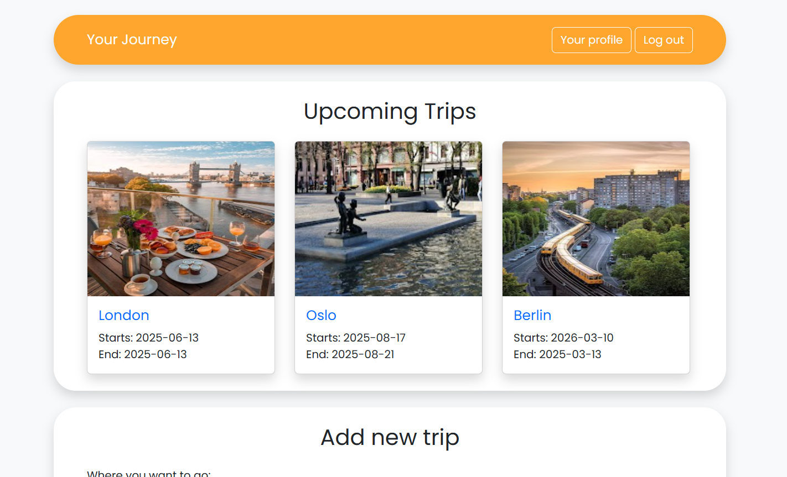

# TripPlanner

**TripPlanner** is an application that helps users plan their trips by allowing them to create, manage, and view their travel plans. Each trip can include various destinations, tourist attractions, and other important elements, making it easy to organize exciting and well-structured getaways.
The application implements an authentication and authorization system using JWT (JSON Web Token).

### Technologies
- **Backend**: Built with Spring Boot, providing a RESTful API for handling trip-related data and operations.

- **Frontend**: Developed using JavaScript and HTML, styled with Bootstrap to create a responsive and visually appealing user interface.

### Features:
- Create and edit travel plans
- Add attractions and destinations to trips
- View trip details

### How to run the application
**Backend (Spring Boot):**

Run the Spring Boot application using your IDE or the following command:
```sh
./mvnw spring-boot:run
```
The backend will be available on port 8080.

**Frontend (JavaScript + HTML + Bootstrap):**

Open the index.html file in your browser
or
use a simple HTTP server (e.g., Live Server in VSCode).

The frontend communicates with the backend via REST API.

### Planned improvements
- Integration with Google Maps API (for route and location display)
- UI enhancements (Frontend)
- Addition of unit and integration tests
- Option to share trips with other users


